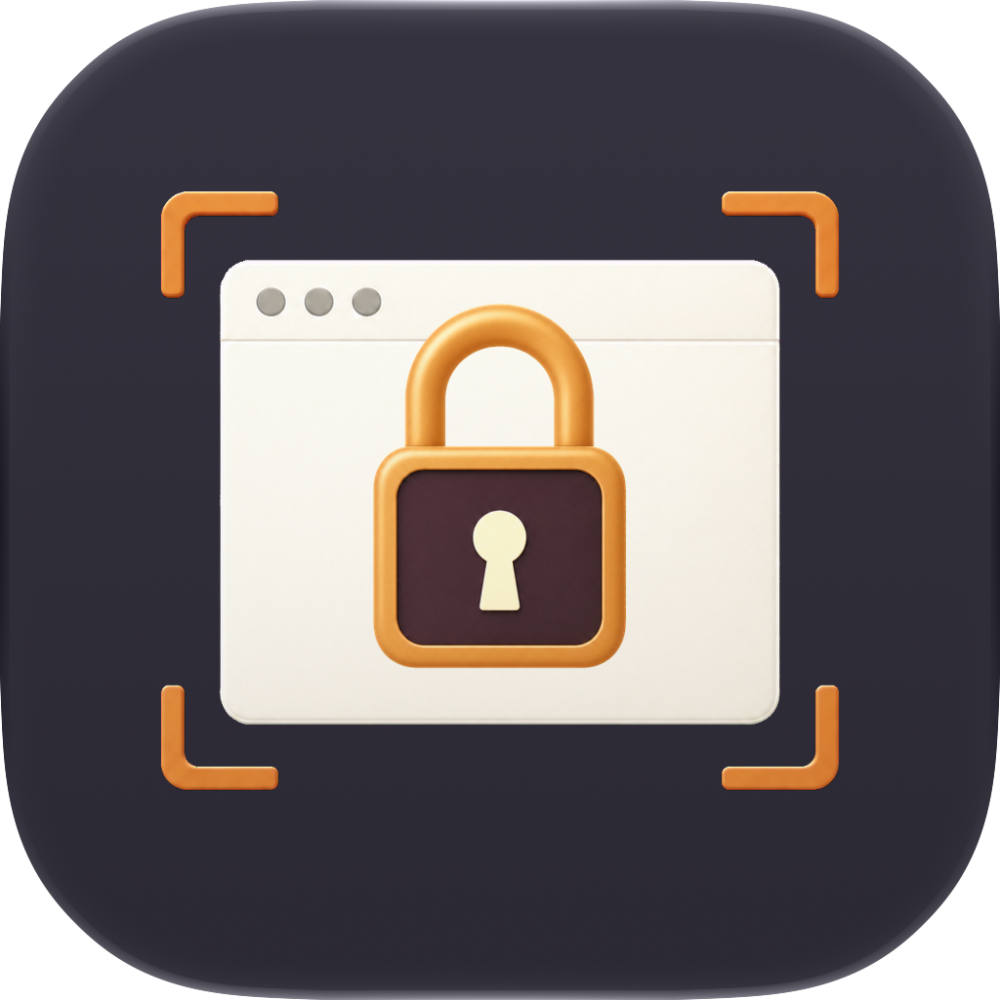
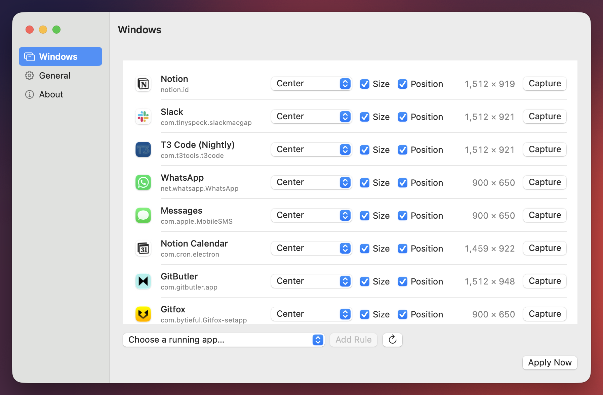

<p align="center">
  
</p>

<h1 align="center">Stay Put</h1>

<p align="center">
  A native macOS app that remembers where your app windows belong.
</p>



Stay Put restores the primary windows of apps you choose after display changes, wake, login, and app launches. It is designed for switching between an external monitor and a MacBook display without repeatedly fixing window sizes and positions.

## Features

- Center windows or fill the left or right half of their current display.
- Restore size and position independently for every app.
- Automatically remember user-driven window resizes.
- Reapply rules after monitor changes, wake, login, and configured app launches.
- Track one primary window per app while ignoring later pop-outs such as Slack huddles and Messages conversations.
- Preserve remembered dimensions when a smaller display temporarily requires clamping.
- Launch at login using `SMAppService`.
- Add installed apps with the standard Open panel or by dragging them from Finder.
- Select, copy, and remove multiple rules with native menu and keyboard commands; removals support Undo.
- Native SwiftUI and AppKit interface with a Dock app, menu-bar shortcut, and macOS settings window.

## How window selection works

Stay Put filters an app's Accessibility windows to standard, non-modal windows, selects the largest candidate during startup restoration, and tracks that exact Accessibility element until it closes. Windows created afterward are treated as pop-outs and ignored.

Placement and sizing work as follows:

- **Center** uses the remembered dimensions when **Size** is enabled.
- **Left Half** and **Right Half** resize to the selected half of the current display.
- **Position** restores the selected placement.
- With **Size** disabled for a centered window, Stay Put preserves its current dimensions.

## Requirements

- macOS 14 or later
- Accessibility permission
- Xcode 15 or later to build from source

## Build and run

```sh
./scripts/build-app.sh
open "dist/Stay Put.app"
```

The build script creates a signed app bundle at `dist/Stay Put.app`. It uses the first available Apple Development signing identity and stops if none is available, because ad-hoc signing invalidates Accessibility authorization on every rebuild. You can override the identity explicitly:

```sh
CODE_SIGN_IDENTITY="Apple Development: Your Name (TEAMID)" ./scripts/build-app.sh
```

On first launch, choose **Grant Access** and enable Stay Put under:

> System Settings → Privacy & Security → Accessibility

Run the test suite with:

```sh
swift test
```

For development without packaging:

```sh
swift run Stayput
```

The development executable has a different process identity from the app bundle, so use the bundled build when testing Accessibility permissions or launch at login.

## Privacy

Stay Put runs locally. Its rules are stored in `UserDefaults`, and it uses the macOS Accessibility API only to inspect, move, resize, and observe windows belonging to configured apps.

## License

[MIT](LICENSE)
